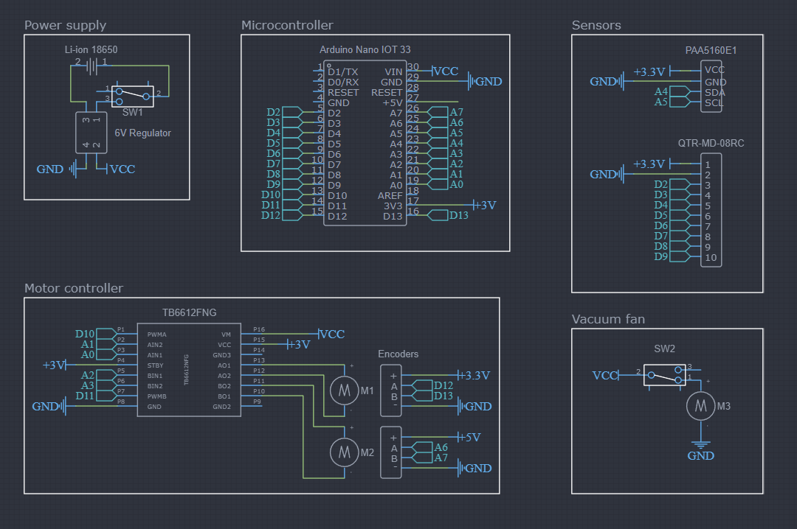

# Concept Prometheus

High speed line following robot with basic SLAM implementation.

Full report can be found [here](docs/assets/Project_Prometheus.pdf).

## Overview
This line-following mapping robot concept is designed to autonomously navigate a predefined path by following a visible line or series of coordinates. The robot uses an infrared sensor array to detect the line, and IMU and optical flow sensors to provide precise position and heading. These components work together to enable the robot to follow a path and adjust its movement accordingly.

## Components 
* Arduino Nano 33 IoT
* Li-Ion 18650 battery
* Charger and voltage regulator module
* CD-rom motor
* 2x N10 220 rpm DC motor
* Sparkfun PAA5160E1 Optical Tracking Odometry Sensor
* 2x Pololu Wheel 40×7mm
* Pololu QTR-MD-08RC IR sensor array
* 2x Pololu ball caster with 3/8" metal ball
* TB6612FNG motor driver

## CAD Model

## Circuit Diagram

