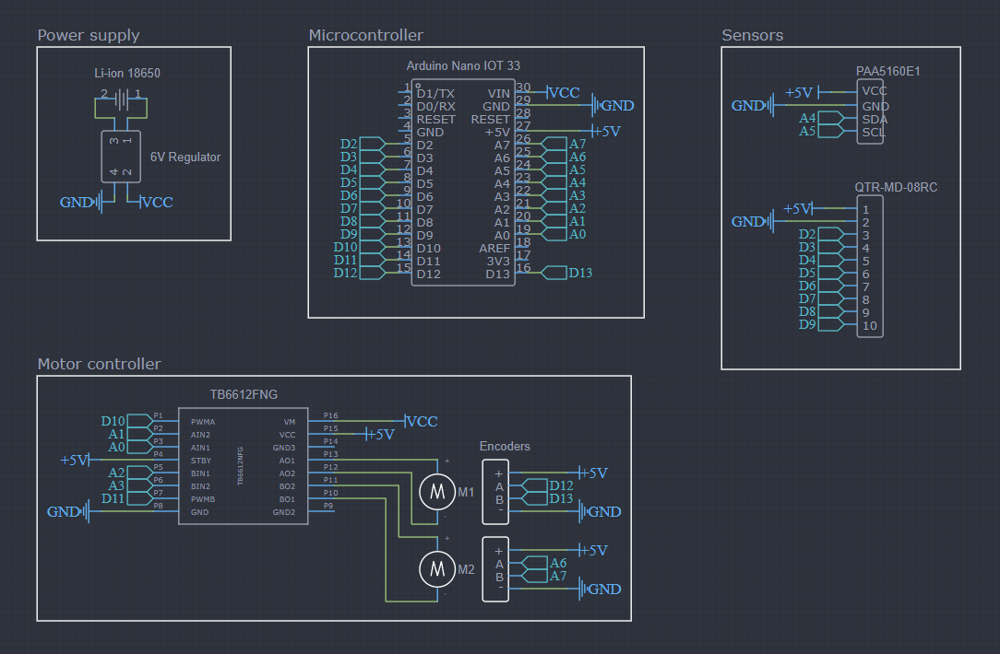

# Line Following Robot

The line-following mapping robot is designed to autonomously navigate a predefined path by following a visible line or series of coordinates. 
The robot uses an infrared sensor array to detect the line. IMU and optical flow sensor are used to give precise position and heading.
This can be combined to follow a path and adjusts its movement accordingly.

## Circuit Diagram

## CAD Model

