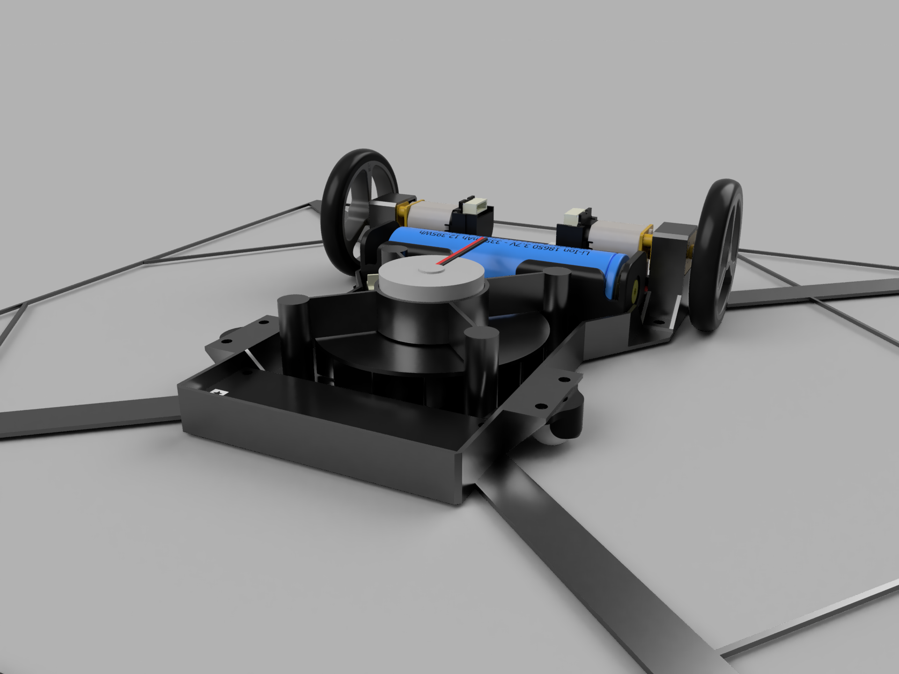
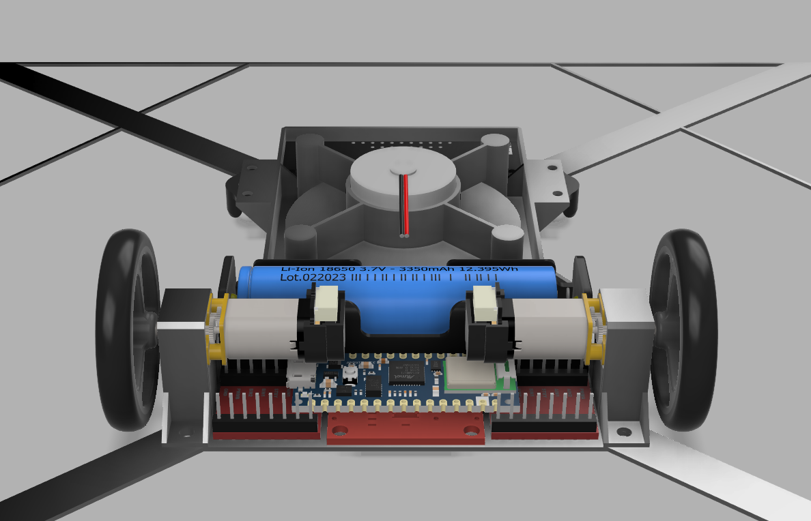
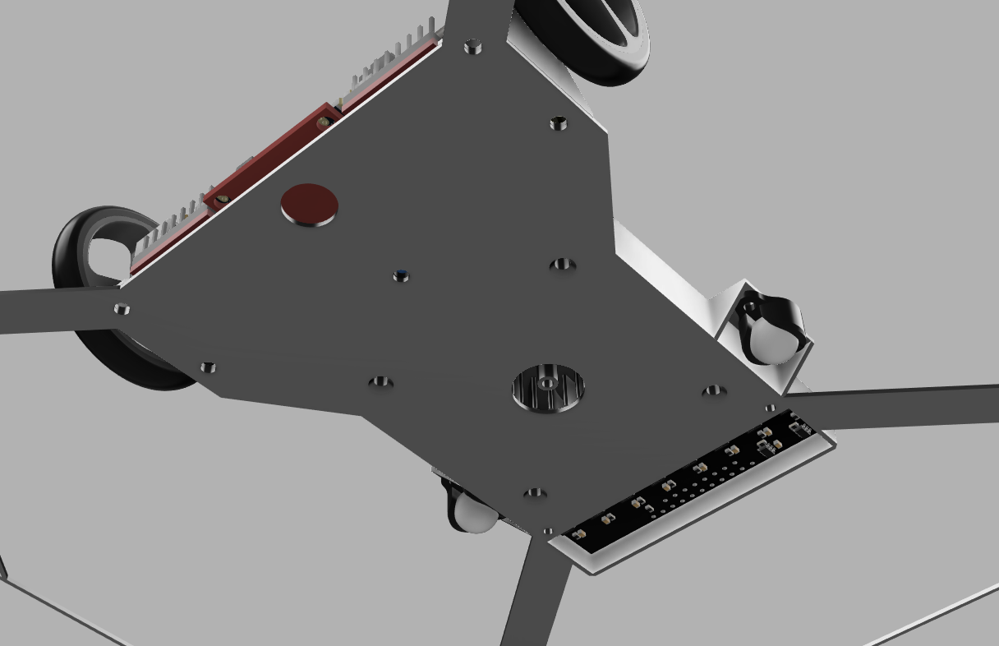

# Line Following Robot

This line-following mapping robot concept is designed to autonomously navigate a predefined path by following a visible line or series of coordinates. 
The robot uses an infrared sensor array to detect the line. IMU and optical flow sensor are used to give precise position and heading.
This can be combined to follow a path and adjusts its movement accordingly. Since this is only a concept idea, the CAD model is not provided.

## Components 
* Arduino Nano 33 IoT
* Li-Ion 18650 battery
* Charger and voltage regulator module
* CD-rom motor
* 2x N10 220 rpm DC motor
* Sparkfun PAA5160E1 Optical Tracking Odometry Sensor
* 2x Pololu Wheel 40×7mm
* Pololu QTR-MD-08RC IR sensor array
* 2x Pololu ball caster with 3/8" metal ball
* TB6612FNG motor driver

## Circuit Diagram

## CAD Model

